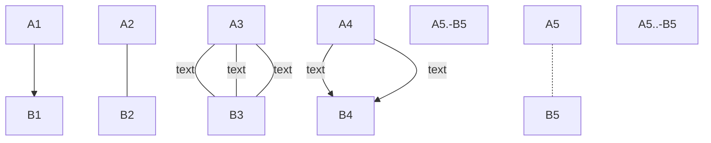
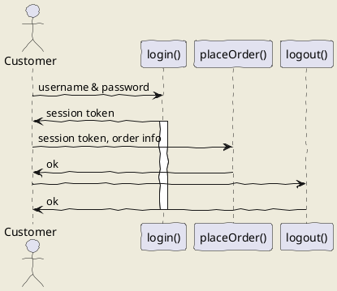
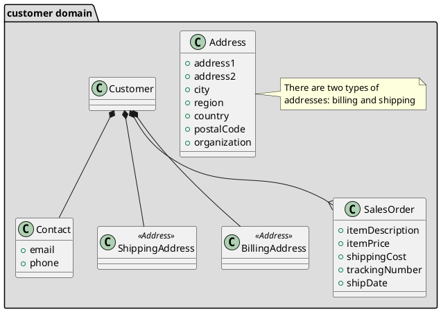
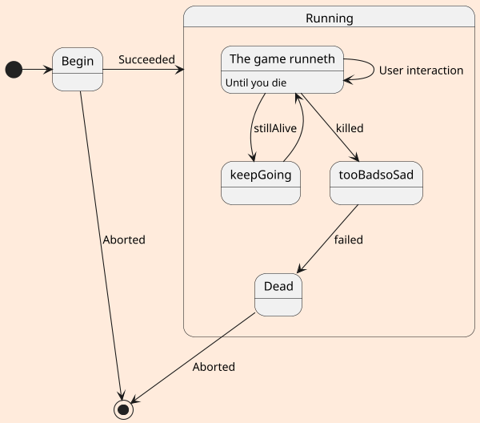
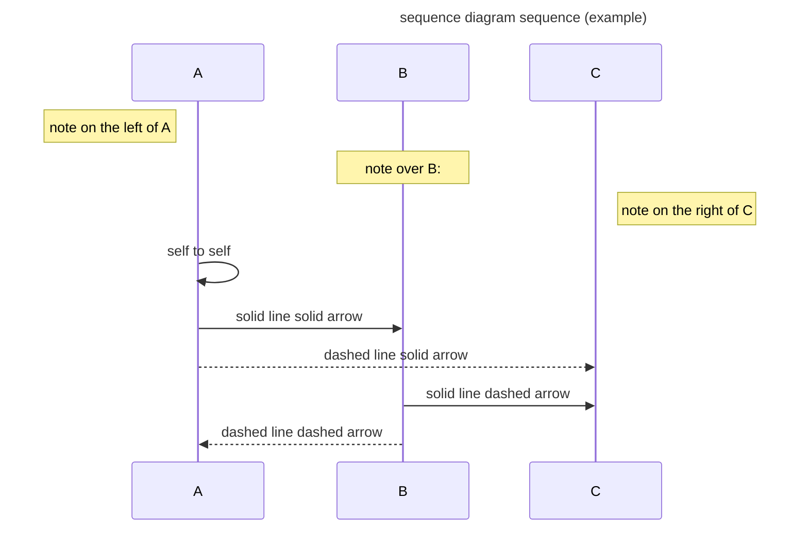

# Computational Thinking for Design
This file contains the overall details of book.  
this is my another line starting with added two spaces.  
Here I am going to give one quote.  
>this is a quote just for example purpose.  
>>this is nested quote.  
>>this is another way of writing my content.

# Title level One
## Title level Two
### Title level Three
### Title level Four
#### Title level Five
##### Title level Six
###### Title level Seven

* List Item 1
+ List nested list
* List Item 2

1. Numbered List one
2. Numbered List two
3. Numbered List three

I am going to give [Google link](https://www.google.com)

these are some of the way to emphasize our text in markdown *Italic text* and _underscored text_ then we have **bold text** even another way is __bold text__

```
here goes program code
```

If you want to mention `printf()` function here.  
This is the way you can link your image. 
 
if you with to give some of scape sequence \*this text\*  
and this is how you have automatice <https://wwww.google.com>  

```c
#include<stdio.h>
int main()
{
    int a, b;
    scanf("%d%d", &a, &b);
    int sum = a + b;
    printf("Sum: %d", sum);

    return 0;
}
```                                                 

Here is Sample code for drawing diagram in markdown:


```mermaid
 graph TD 
 A --> B
 ```
 ```mermaid
 graph LR
 A --> B
 ```
 ```mermaid
 graph BT
 A --> B
 ```
 ```mermaid
 graph RL
 A --> B
 ```
 ```mermaid
 graph TB
 A --> B
 ```

  ```mermaid
 graph TD 
 A1-->B1
 A2---B2
 A3--text---B3
 A3---|text|B3
 A4--text-->B4
 A4-->|text|B4
 A5.-B5
 A5-.-B5
 A5..-B5
 ```
 ```mermaid
 graph TD 
 A6.->B6
 A6-.->B6
 A6..->B6
 A7-.text.-B7
 A8-.text.->B8
 A9===B9
 ```
 ```mermaid
 graph TD 
 A10==>B10
 A11==text===B11
 A12==text==>B12
 ```

 

 <table>
     <tr>
         <td>ID</td>
         <td>NAME</td>
     </tr>
     <tr>
         <td>1</td>
         <td>name1</td>
     </tr>
     <tr>
         <td>2</td>
         <td>name2</td>
     </tr> 
 </table>

| Name | sex | age | 
| - | :-: | -: | 
| Name1 | 男 | 90 | 
| Name2 | 男 | 100 | 
| Name3 | 女 | 90 |


- [x] Markdown  
- [ ] JavaScript 

+ [x] Markdown  
+ [ ] JavaScript 

```mermaid
graph TD
A-->B
C --> name[ naveen D]
E --> nav(rounded F)
G --> flag{diamond F}
```



## uml: sequence diagram
Here I will embed PlantUML markup to generate a sequence diagram.

I can include as many plantuml segments as I want in my Markdown, and the diagrams can be of any type supported by PlantUML.



### uml: class diagram


## uml: state diagram




```gantt
dateFormat  YYYY-MM-DD
title Shop项目交付计划

section 里程碑 0.1 
数据库设计          :active,    p1, 2016-08-15, 3d
详细设计            :           p2, after p1, 2d

section 里程碑 0.2
后端开发            :           p3, 2016-08-22, 20d
前端开发            :           p4, 2016-08-22, 15d

section 里程碑 0.3
功能测试            :       p6, after p3, 5d
上线               :       p7, after p6, 2d
交付               :       p8, afterp7, 2d
```
```java
package com.qyf404.learn.maven;
import org.junit.After;
import org.junit.Assert;
import org.junit.Before;
import org.junit.Test;
public class AppTest {
    private App app;
    @Before
    public void setUp() {app = new App();
    }

@Test
public void testAdd() throws InterruptedException {
    int a = 1;
    int b = 2;
    int result = app.add(a, b);
    Assert.assertEquals(a + b, result);
    }

@After
public void tearDown() throws Exception {

    }

}

class Calc{
    private int a;
    private int b;

    int sum(){
        return a+b;
    }

    int subtract(){
        return a-b;
    }

    int multiply(){
        return a*b;
    }

    int division(){
        return a/b;
    }
}
```

```flow
s=>start: System initialization:>https://github.com/knsv/mermaid
io=>inputoutput: User Input
c1=>condition: KEY is pressed?
c2=>condition: Is the body temperature normal?
o1=>operation: start temperature measurement
o2=>operation: LCD screen displays body temperature
o3=>operation: buzzer sounds
e=>end: end of temperature measurement
s->c1(yes)->o1->o2->c2(yes)->e
c1(no)->c1
c2(no)->o3->e
```

```flow
st=>start: Start:>http://www.google.com[blank]
e=>end:>http://www.google.com
op1=>operation: My Operation
sub1=>subroutine: My Subroutine
cond=>condition: Yes
or No?:>http://www.google.com
io=>inputoutput: catch something...

st->op1->cond
cond(yes)->io->e
cond(no)->sub1(right)->op1
```


$$c = \sqrt{a^{2}+b_{xy}^{2} +e^{x}}$$

$\frac{x^{2}y^{2}}{x+y}$

$\sum_{i=0}^{n}$$\prod_\epsilon$

$\int_{a}^{\pi} f(x) \,dx$ 

$ \lim_{x \to +\infty}\frac{1}{x}$

$$\frac{\partial^2 u}{\partial z^2}$$

$$\cos2\theta = cos^2\theta - \sin^2 \theta \\ =
2\cos^2\theta -1$$

